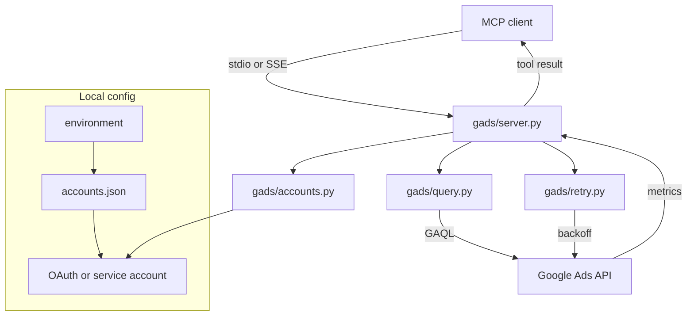
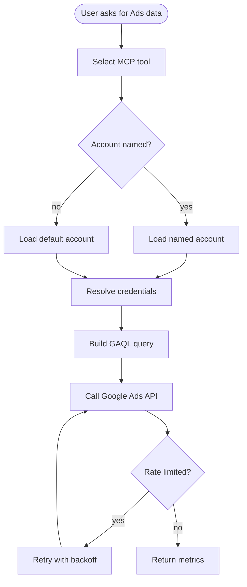

# mcp-google-ads

Multi-account Google Ads MCP server. Connect any number of Google Ads accounts to Claude, Cursor, Codex, or any MCP-compatible AI assistant — query campaign performance, keywords, search terms, and account analytics by name in the same session.

```
# Install:  uvx mcp-google-ads-multi

# Ask your AI:
"Show me campaign performance for account my-client last month"
"What search terms drove conversions for client-acme in Q2?"
"Compare my-account's spend between January and February"
"Which keywords have quality scores below 5 for campaign 123?"
```

---

## Start Here

| You are | Start with | Time |
|---|---|---:|
| Installing the server | [Quickstart](#quickstart) | 10 min |
| Connecting several accounts | [Accounts config](#accounts-config) | 10 min |
| Extending tools | [docs/architecture.md](docs/architecture.md) and `gads/server.py` | 15 min |

---

## Architecture



More detail lives in [docs/architecture.md](docs/architecture.md).

---

## Primary Workflow



---

## Why this one?

Most Google Ads MCP servers support one account per server process. This one lets you configure multiple accounts and switch between them per tool call — no restart needed.

| Feature | This server | Others |
|---|---|---|
| Multiple accounts | Yes — named, switchable | No — one per process |
| OAuth + service account | Both, mixed per account | Usually one type |
| Quality score data | Yes | Rarely |
| Search terms report | Yes | Sometimes |
| Rate limit retry | Yes — exponential backoff | No |
| SSE transport (remote) | Yes | Varies |

---

## Quickstart

**1. Get a developer token** — apply at [Google Ads API Center](https://ads.google.com/aw/apicenter) (free, ~3 business days)

**2. Create OAuth credentials** — [Google Cloud Console](https://console.cloud.google.com/) → Enable Google Ads API → Credentials → OAuth client ID → Desktop app

**3. Create your accounts config:**

```bash
mkdir -p ~/.config/mcp-google-ads
cp accounts.example.json ~/.config/mcp-google-ads/accounts.json
# Edit it — add your accounts
```

**4. Add to your MCP client config:**

```json
{
  "mcpServers": {
    "google-ads": {
      "command": "uvx",
      "args": ["mcp-google-ads-multi"],
      "env": {
        "GOOGLE_ADS_DEVELOPER_TOKEN": "your-developer-token",
        "GOOGLE_ADS_ACCOUNTS_CONFIG": "/Users/you/.config/mcp-google-ads/accounts.json"
      }
    }
  }
}
```

**5. Restart your AI client. Done.**

---

## Accounts config

```json
{
  "default": "my-account",
  "accounts": {
    "my-account": {
      "type": "oauth",
      "client_id": "YOUR_CLIENT_ID.apps.googleusercontent.com",
      "client_secret": "YOUR_CLIENT_SECRET",
      "token_file": "~/.config/mcp-google-ads/my-account.token"
    },
    "client-acme": {
      "type": "oauth",
      "client_id": "YOUR_CLIENT_ID.apps.googleusercontent.com",
      "client_secret": "YOUR_CLIENT_SECRET",
      "token_file": "~/.config/mcp-google-ads/client-acme.token"
    }
  }
}
```

Set `GOOGLE_ADS_DEVELOPER_TOKEN` in your environment. All other credentials stay local.

---

## Available tools

| Tool | What it does |
|---|---|
| `list_accounts` | Show all configured accounts |
| `set_default_account` | Change the default account |
| `list_customers` | List all accessible Google Ads accounts under your login |
| `get_account_summary` | Total clicks, cost, conversions for a period |
| `list_campaigns` | All campaigns with status, budget, 30-day metrics |
| `get_campaign_performance` | Campaign metrics for any date range |
| `compare_periods` | Two date ranges side-by-side with deltas |
| `get_keyword_performance` | Keyword metrics + quality scores |
| `search_terms_report` | Actual search queries that triggered your ads |
| `get_ad_performance` | Ad-level CTR and conversions |

---

## Environment variables

| Variable | Default | Description |
|---|---|---|
| `GOOGLE_ADS_DEVELOPER_TOKEN` | required | Your Google Ads API developer token |
| `GOOGLE_ADS_ACCOUNTS_CONFIG` | `~/.config/mcp-google-ads/accounts.json` | Path to accounts config |
| `MCP_TRANSPORT` | `stdio` | Set to `sse` for remote deployment |
| `MCP_HOST` | `127.0.0.1` | SSE bind host |
| `MCP_PORT` | `3001` | SSE bind port |

---

## License

MIT

## Reference

- [Architecture](docs/architecture.md)
- [Start here](docs/start-here.md)

<!-- mcp-name: io.github.Ayo-Fam/mcp-google-ads -->
