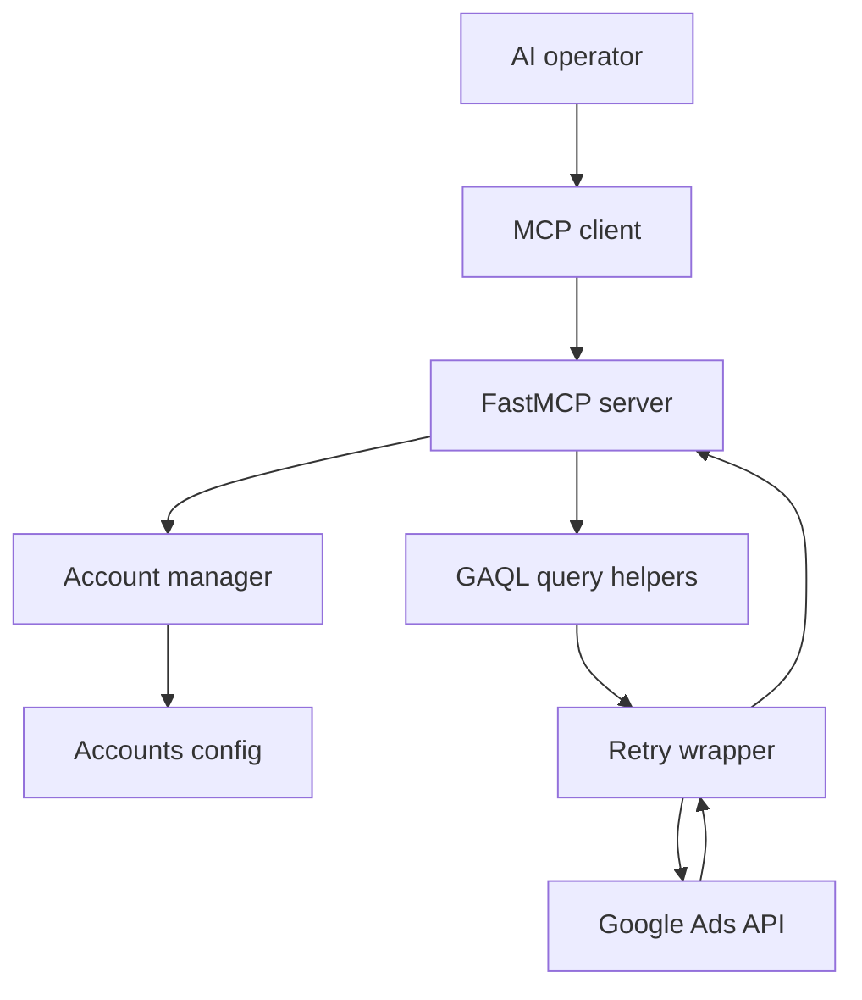
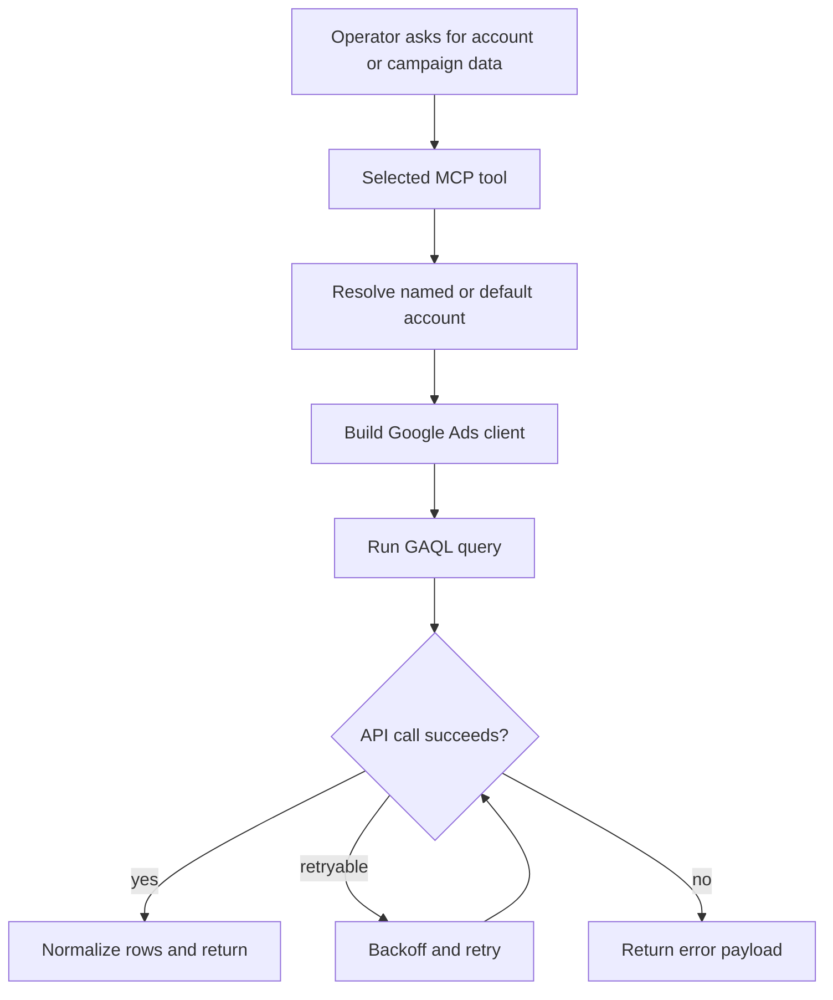

# mcp-google-ads

Multi-account Google Ads MCP server for operators who need one MCP surface across multiple client
or in-house ad accounts without restarting the server.

Release posture: beta package, version `0.1.0` from [`pyproject.toml`](pyproject.toml).

## Choose your path

| You are... | Start here | Then |
|---|---|---|
| Connecting the server to your MCP client | [docs/start-here.md](docs/start-here.md) | Quick start below |
| Auditing account switching and retries | [docs/architecture.md](docs/architecture.md) | [`gads/server.py`](gads/server.py) |
| Reviewing packaging metadata | [`pyproject.toml`](pyproject.toml) | [`accounts.example.json`](accounts.example.json) |

## Architecture



## Request flow



## Quick start

1. Install the package.

```bash
python -m pip install mcp-google-ads-multi
```

2. Copy the accounts config template and add your accounts.

```bash
mkdir -p ~/.config/mcp-google-ads
cp accounts.example.json ~/.config/mcp-google-ads/accounts.json
```

3. Register it in your MCP client.

```json
{
  "mcpServers": {
    "google-ads": {
      "command": "uvx",
      "args": ["mcp-google-ads-multi"],
      "env": {
        "GOOGLE_ADS_DEVELOPER_TOKEN": "your-developer-token",
        "GOOGLE_ADS_ACCOUNTS_CONFIG": "/Users/you/.config/mcp-google-ads/accounts.json"
      }
    }
  }
}
```

## Available tools

| Tool group | Tools | Purpose |
|---|---|---|
| Account selection | `list_accounts`, `set_default_account`, `list_customers` | Manage account routing and discover accessible customers |
| Spend summary | `get_account_summary`, `compare_periods` | Period-over-period account reporting |
| Campaign analysis | `list_campaigns`, `get_campaign_performance` | Campaign inventory and range-based metrics |
| Query-level detail | `get_keyword_performance`, `search_terms_report`, `get_ad_performance` | Keyword, search-term, and ad reporting |

## Runtime proof

| Claim | Proof |
|---|---|
| Package entry point is stable | `mcp-google-ads-multi = "gads.server:main"` in [`pyproject.toml`](pyproject.toml) |
| Multi-account routing is first-class | `AccountManager()` and `set_default_account()` in [`gads/server.py`](gads/server.py) |
| Queries go through reusable helpers | [`gads/query.py`](gads/query.py) and [`gads/retry.py`](gads/retry.py) |
| Config is file-driven | [`accounts.example.json`](accounts.example.json) documents the accounts shape |

## Repo map

| Path | Purpose |
|---|---|
| [`gads/server.py`](gads/server.py) | FastMCP tool surface |
| [`gads/accounts.py`](gads/accounts.py) | Account config, OAuth/service-account loading |
| [`gads/query.py`](gads/query.py) | GAQL execution helpers |
| [`gads/retry.py`](gads/retry.py) | Retry behavior for API calls |
| [`docs/start-here.md`](docs/start-here.md) | Setup, validation, common failures |
| [`docs/architecture.md`](docs/architecture.md) | Component map and request lifecycle |

## Validation

| Check | Command |
|---|---|
| Import compiles | `python -m compileall gads` |
| Package builds | `python -m build` |
| README/docs links are local | `rg '\\]\\(([^)]+\\.md)\\)' README.md docs/` |

## License

MIT

<!-- mcp-name: io.github.Ayo-Fam/mcp-google-ads -->
