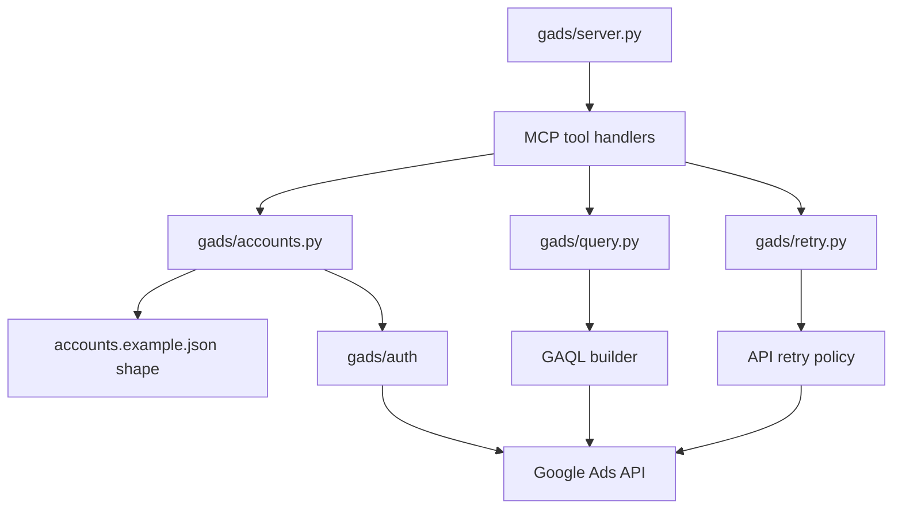
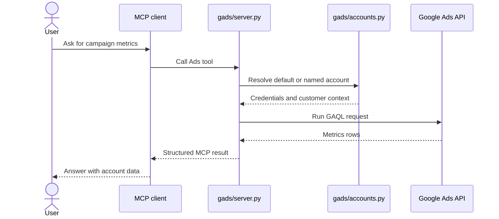

# Architecture

`mcp-google-ads` is a Python MCP server around the Google Ads API. Its main job is to route a
natural-language AI request into a named Google Ads account, build a GAQL query, and return a
structured MCP result.

## Components

## Request Sequence

## Data Boundaries

| Data | Source | Storage |
|---|---|---|
| Developer token | Environment variable | Never committed. |
| Account map | `accounts.json` based on `accounts.example.json` | Local config path. |
| OAuth token files | Paths declared per account | Local machine or mounted config. |
| Google Ads metrics | Google Ads API | Returned through MCP; not persisted by this repo. |

## Extension Points

| Change | File |
|---|---|
| Add a new MCP tool | `gads/server.py` |
| Add account-loading behavior | `gads/accounts.py` |
| Change Ads query construction | `gads/query.py` |
| Tune transient error handling | `gads/retry.py` |
